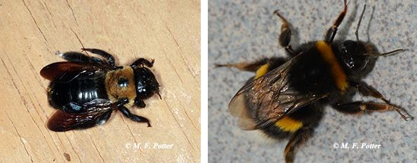

# Introduction

During the spring, people often notice large, black bees hovering around the outside of their homes. These are likely to be carpenter bees, named for their habit of excavating holes in wood, in order to rear their young. Carpenter bees prefer unpainted, weathered wood, especially softer varieties such as redwood, cedar, cypress and pine. Painted or pressure-treated wood is much less susceptible to attack. Common carpenter bee nesting sites include eaves, rafters, fascia boards, siding, wooden shake roofs, decks and outdoor furniture.

## Biology and Habits
Carpenter bees do not live in colonies like honeybees or bumblebees. The adults overwinter individually, often in previously constructed brood tunnels. Those that survive the winter emerge and mate the following spring. Fertilized female carpenter bees then bore into wood, excavating a tunnel to lay their eggs. The entrance hole in the wood surface is perfectly round and about the diameter of your little finger. Coarse sawdust may be present below the opening, and tunneling sounds are sometimes heard within the wood. After boring in a short distance, the bee makes a right angle turn and continues to tunnel parallel to the wood surface. Inside the tunnel, about five or six cells are constructed for housing individual eggs. Working back to front, the bee provisions each cell with pollen (collected from spring-flowering plants) and a single egg, sealing each successive chamber with regurgitated wood pulp. Hatching and maturation occurs over several weeks, with the pollen serving as a food source for the developing larvae. Later in the summer, the new generation of adult bees emerge and forage on flowers, returning to wood in the fall for hibernation.   

## Nuisance and Damage
Though seldom as destructive as termites, carpenter bees can cause cosmetic and structural damage. Female carpenter bees excavate new tunnels in wood for egg laying, or enlarge and reuse old ones. Significant damage can occur when the same pieces of wood are infested year after year. Holes in the wood surface also facilitate moisture intrusion, rot and decay.

Carpenter bees are less inclined to sting than wasps and bees living in communal colonies. Still, their presence can be daunting, especially during spring mating and nest construction. Male carpenter bees can be especially intimidating, hovering in front of people who are around nesting sites. The males are harmless, however, since they lack the ability to sting. Female carpenter bees can inflict a painful sting but will seldom do so -- unless they are handled or bothered by people. 

Other types of small solitary bees and wasps are sometimes seen visiting abandoned carpenter bee nests. These insects seldom cause problems and are usually scavenging on remaining pollen or using the tunnels for shelter.    

## Control and Prevention
The best time to control carpenter bees is before tunnels are fully constructed. Liquid, aerosol or dust insecticides containing ingredients such as bifenthrin, cyfluthrin, deltamethrin or lambda cyhalothrin can be applied directly into tunnel openings. Leave the holes open for a few days after treatment to allow the bees to contact and distribute the insecticide throughout the nest tunnel.  Then plug the entrance hole with a piece of wooden dowel coated with carpenter's glue, putty, or other suitable sealant.  This will deter future bees from using the old tunnels, as well as moisture intrusion and wood decay. 