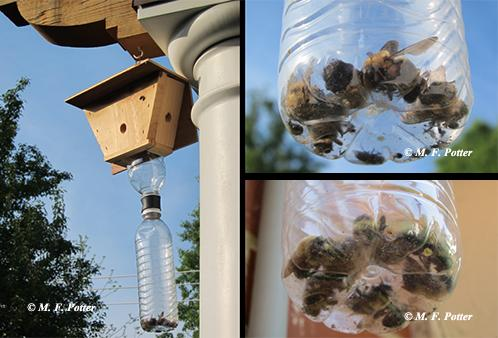

# Advanced: Booby Traps

- A more extensive treatment of wood surfaces may be helpful when large numbers of carpenter bees are attacking siding, shake roofs, decks, etc. Spraying vulnerable wood with one of the aforementioned insecticides will cause some bees to avoid drilling into treated surfaces. For application use a pump up or hose end sprayer to target areas most favored by carpenter bees (eaves, fascia boards, joist ends of decks, etc.). Longevity of such treatments is only about 3-4 weeks, so reapplication may be needed. Although carpenter bees are less aggressive than wasps, females provisioning their nests may sting. Consider treating at dusk or while wearing protective clothing. 

- Another tip that may help reduce carpenter bee drilling is to install traps. Carpenter bee traps can be constructed from simple materials or purchased online. Most consist of a small wooden box with ½-inch diameter holes drilled in each side and a plastic water bottle suspended below. In early spring, suspend the traps from eaves and overhangs at the corners of the house, porch, deck, shed, barn, etc. Carpenter bees searching for nesting sites enter the holes in the wooden box, fall into the plastic bottle, and are not able to find their way out, eventually dying. Accumulations of dead bees are disposed of by unscrewing and rinsing out the bottle. 

- Carpenter bees usually will not tunnel into painted wood. Therefore, a more permanent solution is to paint unfinished wood surfaces, especially those with a history of infestation. Stains and preservatives are less reliable than painting, but may afford some repellence versus bare wood.  It also helps to keep garages and outbuildings closed when bees are actively searching for nesting sites, which usually subsides by late spring.     