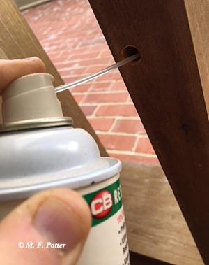
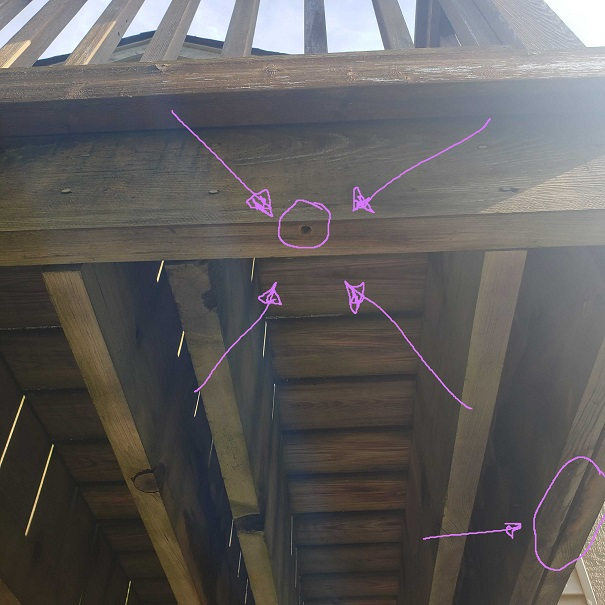
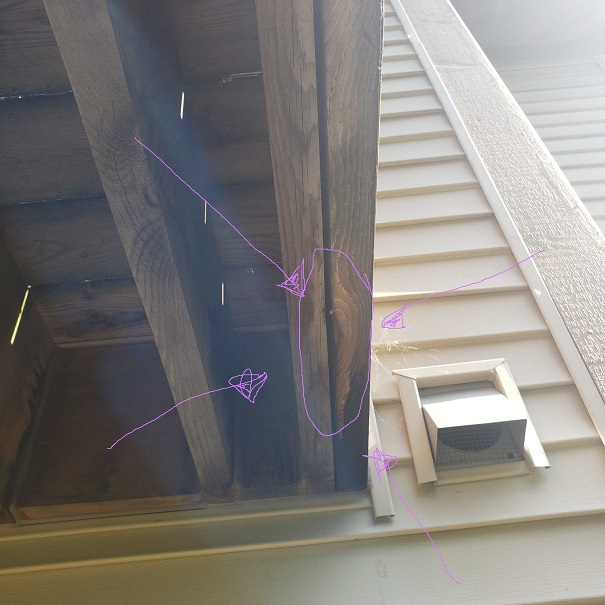

# Treating for Carpenter Bees

##### Sources: https://entomology.ca.uky.edu/ef611

:::tip Precautions

Although carpenter bees are less aggressive than wasps, females provisioning their nests may sting. **Consider treating at dusk or while wearing protective clothing.**

:::

## Plan of Attack

- [ ] 1 - **Apply directly into [tunnel opening(s)...](#tunnel-openings)**

- [ ] 2 - **Leave the holes open for a few days to allow bees to contact and distribute the insectide throughout the nest tunnel**

- [ ] 3 - **Plug the entrance hole with a piece of wooden dowel coated with carpenter's glue, putty, or other suitable sealant. This will deter future bees from using the old tunnels.**

#### Tunnel Openings

